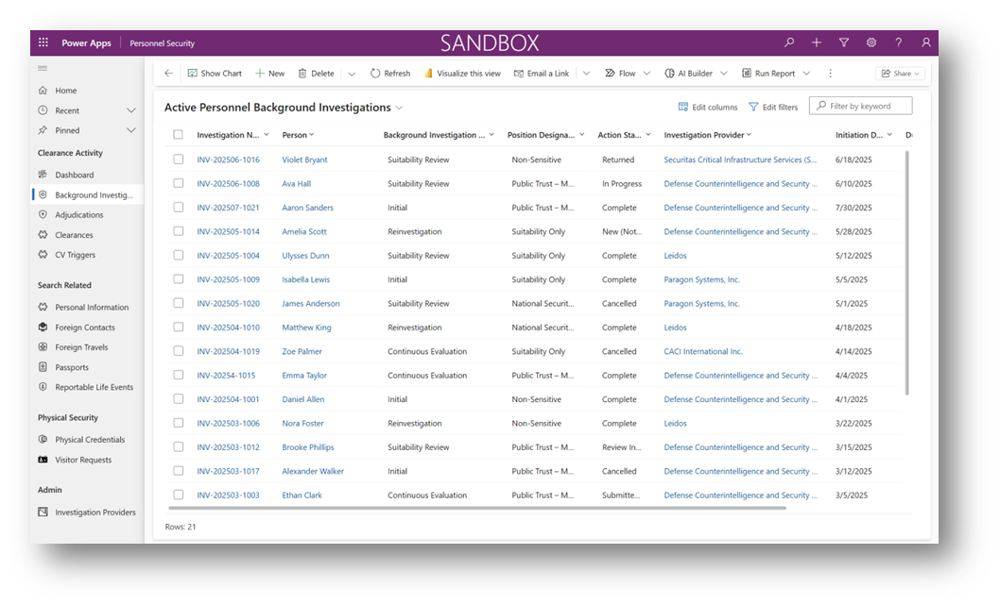

# Personnel Security Overview

# Background Investigations

The personnel security lifecycle begins when a Background Investigation (BI) is initiated for an individual under consideration for a sensitive position. 

A security administrator or authorized user creates a Background Investigation record in the system, linking it to the person’s core profile and capturing key metadata like investigation type, initiation date, and the agency or provider conducting the investigation.

